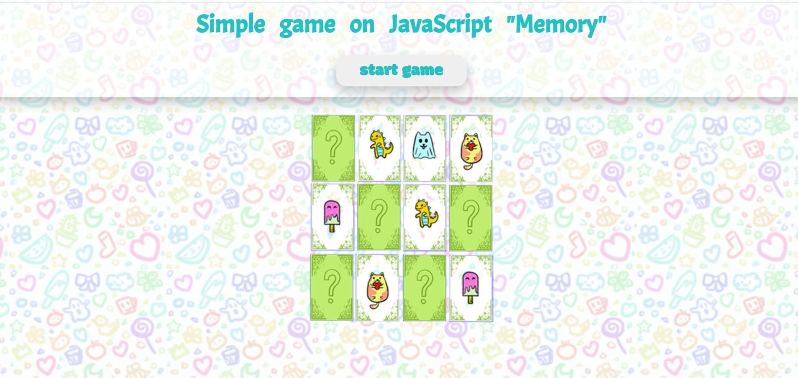

# Memory game - simple game on JS
## the game "find the same cards"
 

## Rules
+ Find cards with the same pictures for 30 seconds
+ Turn two cards one by one by clicking on them
+ If you find the same card you get 1 score, if you find all cards at the set time - you win

## development stack
+ HTML
+ CSS
+ JS
+ Gulp

[lets play](https://memory-game-on-js.netlify.app/)

